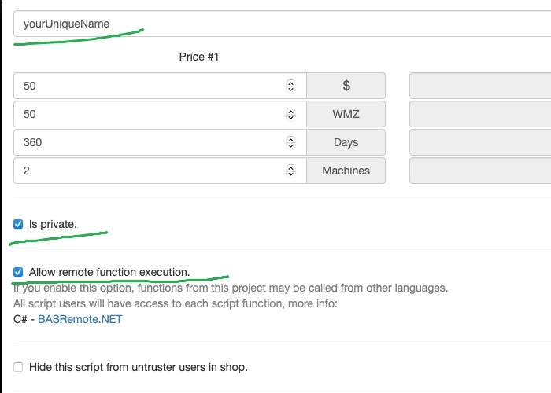

# Python library, which allows you to automate Google Chrome browser via BAS software.

## WARNING: this is proof of concept, work in progress

## Prerequisites:

- You need to be a premium user in order to create project with custom functions: https://bablosoft.com/shop/BASPremium

## Prepare:

- Create new script: https://bablosoft.com/bas/scripts:
    - provide some cool new name of script
    - check **Allow remote function execution.**
    - check **Is private.**:



- `Create new user` and `Give script to user`: https://bablosoft.com/bas/users
- Install BAS software
- Open project in BAS, located in `./docs/BasPythonApi.xml`
- Compile it and upload project to the BAS server:


## Example usage:

```python
import asyncio
import logging
import os

from dotenv import load_dotenv

from bas_client import BasClient, RemoteTransportOptions

ABS_PATH = os.path.normpath(os.path.join(os.path.dirname(__file__)))  # root project directory

logging.basicConfig(level=logging.DEBUG)

dotenv_path = os.path.join(ABS_PATH, ".env")
if os.path.exists(dotenv_path):
    load_dotenv(dotenv_path=dotenv_path)

remote_script_name = os.environ.get("TEST_REMOTE_SCRIPT_NAME", "BasPythonApi")
remote_script_user = os.environ.get("TEST_REMOTE_SCRIPT_USER", None)
remote_script_password = os.environ.get("TEST_REMOTE_SCRIPT_PASSWORD", None)


async def main():
    transport_options = RemoteTransportOptions(
        remote_script_name=remote_script_name,
        remote_script_user=remote_script_user,
        remote_script_password=remote_script_password,
    )
    client = BasClient(transport_options=transport_options)
    await client.set_up()

    await client.browser.load(url="https://www.google.com/", referer="https://www.google.com/")
    current_url = await client.browser.current_url()
    print(current_url)

    page_html = await client.browser.page_html()
    print(page_html[:100])

    await client.browser.load(url="https://www.python.org/")
    current_url = await client.browser.current_url()
    print(current_url)

    await client.clean_up()


if __name__ == "__main__":
    asyncio.run(main())

```
